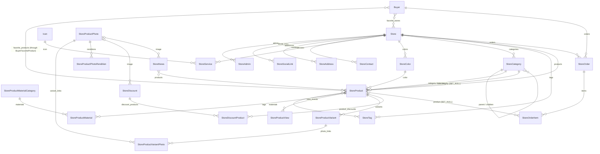

# Models and relationships

Every business model (except `Store`, `Icon`, `Buyer`) carries a `store` FK — that's what tenancy filtering keys on.
Most models extend `core.models.TimestampedModel` (`created_at`, `updated_at`, default ordering `-created_at`).
`StoreAdmin` and `Buyer` extend `core.models.AbstractAuthAccount` (`login`, `hashed_password` (argon2), `active`).

## ER diagram (simplified — the `store` FK on every row is omitted unless it's the main link)



## stores

| Model | Key fields / notes |
|---|---|
| `Store` | `name`, `description`, `phone`, `email`, `active` (inactive stores disappear from all public endpoints). Not a `TimestampedModel` but has its own timestamps. |
| `StoreAdmin` | auth account, FK `store`. One admin = full control of exactly one store. No platform-level admin principal exists. |
| `Icon` | global catalog (not store-scoped), unique `name`. Picked by `StoreService.icon` (PROTECT). |
| `StoreSocialLink` | `platform` (choices), `nickname`, `url`, `visible`. |
| `StoreAddress` | `name`, `address`, `landmark`, `working_hours`, `phone`. |
| `StoreContact` | `name`, `role`, `phone`, `hours`, `telegram`, `has_telegram`. |
| `StoreService` | `icon`, `title`, `kicker`, `description`, `visible`. |
| `StoreColor` | `name`, `hex_code` (validated `#RGB`/`#RRGGBB`). Used as `StoreProduct.color`. |

Public store endpoint only shows `visible=True` social links/services (prefetched with `to_attr`).

## buyers

| Model | Key fields / notes |
|---|---|
| `Buyer` | auth account; `last_name`, `first_name`, `middle_name`, `age`, `gender`, `city`; avatar: `avatar_photo` → `avatar_photo_processed` + `avatar_processing_status` (see images.md). M2M `favorite_products` (through `BuyerFavoriteProduct`), M2M `favorite_stores`. |
| `BuyerFavoriteProduct` | through model with `created_at` — needed so "most favorited" reports can count within a date range. Unique (buyer, product). |

## products

| Model | Key fields / notes |
|---|---|
| `StoreCategory` | `name` (unique per store), self-FK `parent` (PROTECT, `children`), `visible` (hides its products publicly), `cover` → `cover_processed` + `cover_processing_status`. Top-level = category, child = subcategory. |
| `StoreTag` | `name` (unique per store). |
| `StoreProductMaterialCategory` | grouping for materials only — unrelated to `StoreCategory`. |
| `StoreProductMaterial` | `name`, optional FK `category` → material category. |
| `StoreProduct` | `name`, `slug` (**globally unique** across all stores — storefront URL is `/products/<slug>`; optional on input, generated server-side, see below), `category` (required, PROTECT), `subcategory` (optional, must be a child of `category`), `description`, `brand`, `manufacture`, M2M `materials`, M2M `tags`, FK `color`, `size` = **`ArrayField(int)`** (available sizes), three optional prices `price_sale` / `price_rental` / `price_tailoring`, flags `is_sellable`, `is_rentable`, `blur_image_in_site`, `views` (lifetime counter, not editable). |
| `StoreProductView` | one row per authenticated-buyer view; enables date-ranged "most viewed" reports. Only buyers count (not anonymous, not admins). |
| `StoreProductPhoto` | `uuid` (storage key), `image` (original), `original_filename`, `processing_status`. Store-scoped, **not tied to one product** — reused by variants, discounts, news. |
| `StoreProductPhotoRendition` | `photo` FK, `quality` (`large`/`medium`/`small`), `image`. Unique (photo, quality). Created only by the Celery task. |
| `StoreProductVariant` | FK `product`, M2M `photos` through `StoreProductVariantPhoto` (same photo can appear in several variants). Photos are reached through variants: `product.variants.photos.renditions`. |
| `StoreProductVariantPhoto` | through row: FK `variant`, FK `photo`, `order` (position of the photo within that variant). Unique per (variant, photo). Read in `order` via `variant.photo_links`. |
| `StoreDiscount` | `title`, `description`, optional `starts_at`/`ends_at`, `status` (draft/active/archived), M2M `products` through `StoreDiscountProduct`, optional FK `image` → `StoreProductPhoto` (SET_NULL). |
| `StoreDiscountProduct` | per-product `discount_type` (`fixed_amount`/`percentage`) + `value`. Unique (discount, product). |

Product slug rules (`products/slugs.py`, used by `StoreProductSerializer._resolve_slug`):

- Create without `slug` (or with `""`/`null`): built from `name`. Cyrillic (Russian + Uzbek) is transliterated
  first, then `slugify` runs (`"Красное платье"` → `krasnoe-plate`). An empty result falls back to `product`.
- A sent `slug` is used as-is.
- Either way, a value taken by another product gets `-2`, `-3`, … (never a 400).
- PATCH without `slug` keeps the current slug, even if `name` changes, so shared URLs don't break. PATCH with a
  value applies the same rules, and the product's own current slug doesn't count as a conflict.
- Two simultaneous creates can still collide; the DB unique constraint then returns a 409 for the second one.

"Active discount" = `status=active` and now inside `[starts_at, ends_at]` (either bound may be null).
Logic lives in `products/discounts.py` (`active_discount_products()`, `prefetch_active_discounts()`), shared by the
public product serializer and checkout pricing.

## news

| Model | Key fields / notes |
|---|---|
| `StoreNews` | `title`, `news_type` (event/discount/holiday/other), `slug` (unique per store), `description` (may contain HTML), required `starts_at`/`ends_at`, `status` (draft/active/archived), M2M `products`, optional FK `image` → `StoreProductPhoto` (SET_NULL). Public = active store + `status=active` + now within window. |

## orders

| Model | Key fields / notes |
|---|---|
| `StoreOrder` | FK `store`, FK `buyer`, `status`, `cancelled_by` (buyer/store), `cancellation_reason`. One order per store — a multi-store cart becomes several orders (the frontend splits and calls checkout once per store). |
| `StoreOrderItem` | FK `order`, nullable FK `product` (SET_NULL), immutable `product_snapshot` (JSON of `PublicProductSerializer` at checkout), `size` (single int, must be in `product.size` if the product has sizes), `quantity`, `price_type` (sale/rental/tailoring), per-unit `base_price` / `final_price`, `applied_discount` snapshot (the single discount giving the biggest reduction — `orders/services.py: resolve_price`). |

Status machine (`orders/models.py: ALLOWED_STATUS_TRANSITIONS`):

```
pending_confirmation → confirmed | cancelled
confirmed            → delivered | cancelled
delivered            → closed | returned
closed, cancelled, returned: terminal
```

Store admins PATCH status along these edges (reason required when cancelling). Buyers can only cancel, only while
`pending_confirmation`, and only with a buyer-side reason (`BUYER_CANCELLATION_REASONS`).

## Delete behavior worth remembering

- Deleting a `StoreCategory` that has products (or child categories) fails with PROTECT. Django's `ProtectedError`
  subclasses `IntegrityError` but has no SQLSTATE, so `core/exceptions.py` returns its generic 409 `integrity_error`.
- Deleting a product keeps order items (`product` → NULL; `product_snapshot` survives).
- Deleting a photo used as a news/discount image nulls the `image` FK.
